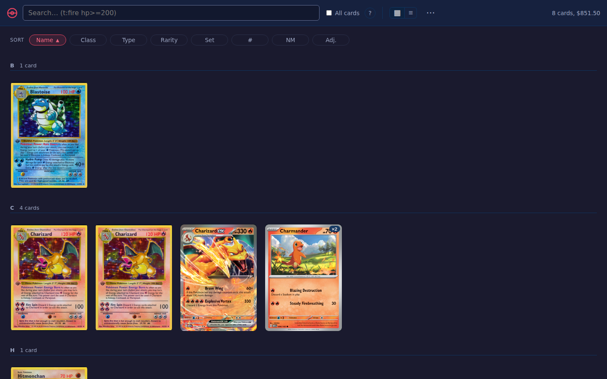
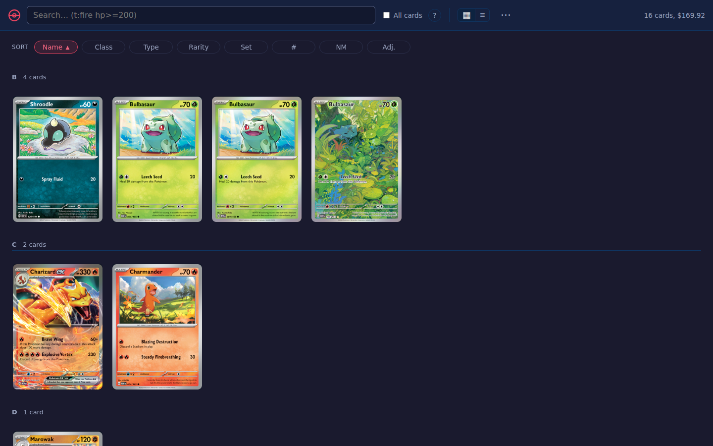

# Per-tenant isolation — visual evidence

Two tenants, one instance, one build. The **only** difference between these two
screenshots is the `x-pkdump-tenant` request header.

| `x-pkdump-tenant: alice` | `x-pkdump-tenant: bob` |
|---|---|
|  |  |
| 8 cards, $851.50 | 16 cards, $169.92 |

Captured against a throwaway `--test` instance (`deploy/setup.sh mtdemo --test`)
with `PKDUMP_MULTITENANT=1` set **on that instance only** — the shipped
`deploy/pkdump.container` does not set it and must not.

The frontend is unchanged by this epic and does not send the header, so this was
driven with Playwright's `extraHTTPHeaders`. That is the point of the
"browser-reachable multitenancy waits on the identity epic" note in
`deploy/TENANTS.md`: the substrate is here, the front door is not.

## Resolver behaviour, same instance

```
x-pkdump-tenant: alice     -> 200
x-pkdump-tenant: bob       -> 200
(no header)                -> 400   must name a tenant
x-pkdump-tenant: mallory   -> 404   unknown tenant; no database created
```

## Layout this exercised

```
/data/
  shared.sqlite          <- the catalog, ONE copy, outside tenants/
  tenants/
    alice.sqlite
    bob.sqlite
    collection.sqlite    <- the original single user
```

`shared.sqlite` sitting outside `tenants/` is load-bearing, not tidiness: it makes
"every `*.sqlite` under `tenants/`" an exact description of the irreplaceable set,
which is what Litestream's `dir:`+`pattern:`+`watch:` mode replicates.
